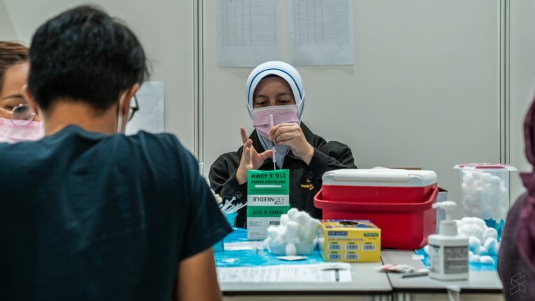
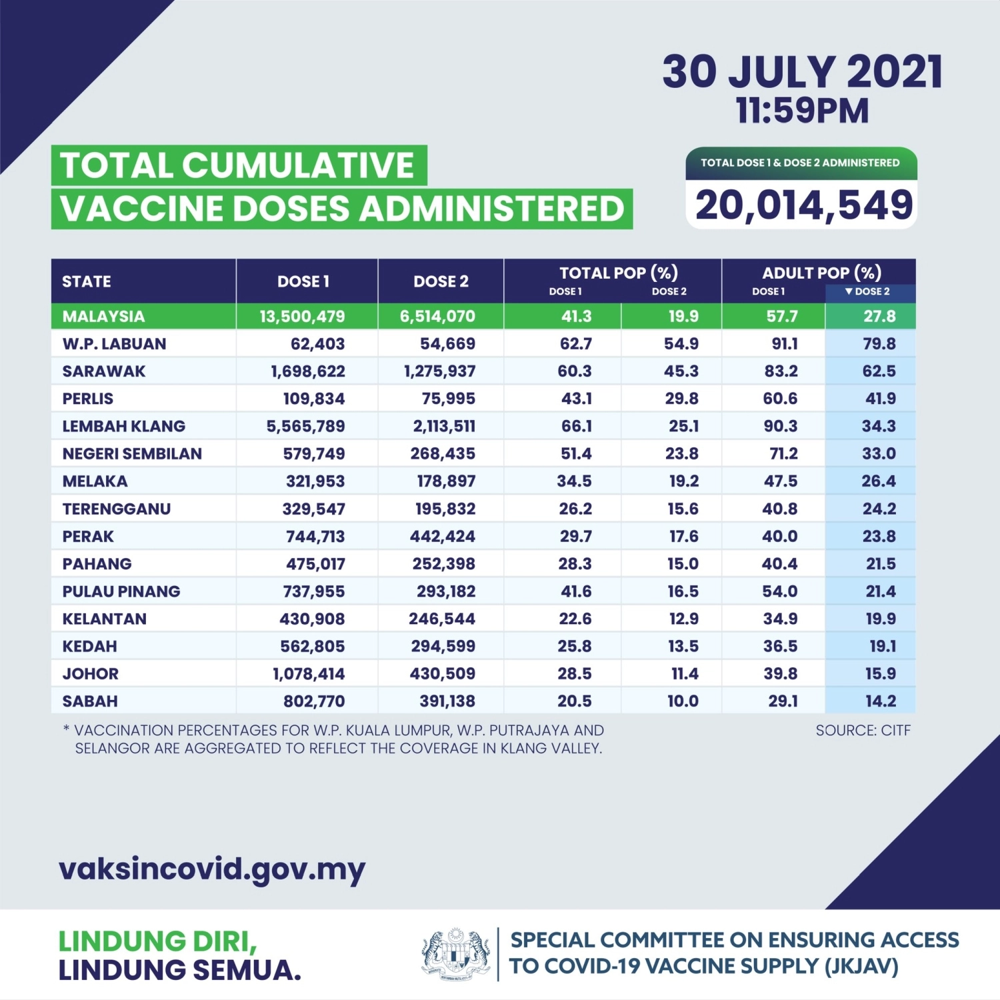

#### Walk-in vaccination in Klang Valley begins 2 August for 40 and above, open to all on 5 August

With Operation Surge Capacity expected to end on 1st August, vaccination coordination minister Khairy Jamaluddin has announced that walk-in COVID-19 vaccinations for remaining adults below 60 years old in Kuala Lumpur and Selangor will begin starting this coming Monday. The walk-in vaccinations will be implemented in stages based on age groups and comorbidities.

Walk-ins are applicable for those who have not received appointments, individuals who have previously cancelled their appointments or have not yet registered for the national immunisation programme.

###### 40 years and above, or adults with comorbidities
Walk-ins will be open to all adults residing in Kuala Lumpur and Selangor aged 40 years old and above as well as people with comorbidities starting this Monday, 2nd August. This means if you’re below 40 but have a chronic disease, you are able to walk-in starting this Monday.

Prior to this, walk-ins are already offered for senior citizens (aged 60 years old and above) in the Klang Valley since 17th July 2021.

###### All remaining adults below 40 years old
For all remaining adults aged 18 years and above residing in Kuala Lumpur and Selangor, walk-ins will be available from Thursday, 5th August.

###### List of Walk-in PPVs will be announced soon
According to Khairy, walk-ins at vaccination centres (PPV) are offered on a first-come, first-served basis depending on their capacity. He said the public will be informed about the capacity of the day. For those who don’t manage to get a slot, they will be prioritised for the following day.

He said not all PPV will accept walk-ins and a list of premises will be announced by the COVID-19 immunisation task force.

As of yesterday, over 5.5 million out of 6.1 million (90.3%) of adults in the Klang Valley have received at least one dose. Under operation surge capacity, the CITF aims to vaccinate all adults in the Klang Valley with at least one dose by 1st August.

Khairy also clarified that this doesn’t mean by August, there won’t be any more vaccinations in the Klang Valley. Vaccinations for the second dose are still ongoing and they are making sure nobody misses out including undocumented migrants.

([source](https://www.malaymail.com/news/malaysia/2021/07/31/khairy-walk-in-vaccinations-in-klang-valley-begin-on-august-2/1994109))

