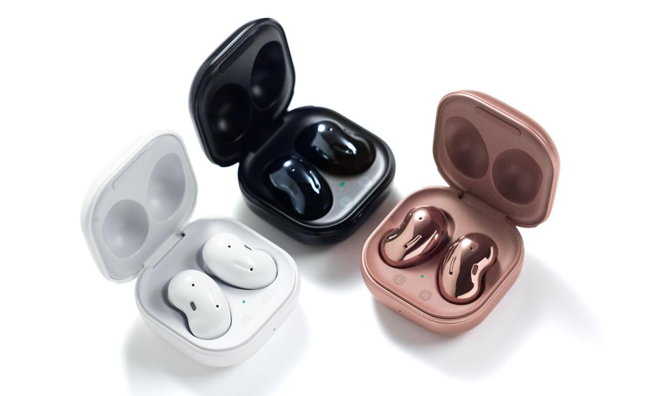

A friend of mine recenlty bought a phone which did not comes with a headphone jack! Yeah I know it's 2021 who needs a headphone jack anymore right kepeessh! So he ask me where to get one of those high quality wired earphones that uses the device's charging port, Nanii? Like huh?!? 

So I explained to him why would he need a wired earphone when you can get bluetooth ones. He states that it will cause some inteference when playing his favorite mobile game. But what if you're in the middle of the game and the battery gone low and needs a charge, yeap you need to unplug the wired earphones in order to charge your mobile phone. Super tedious right. 

The best way to solve this is to advice him to get a pair of Buletooth earphones. But he didn't know which brands to pick depends on his budget. So to everyone who plans to purchase a pair of those. I do recommend to look for different brands that are above RM 60. Trust me on this, because you do not want to keep on worrying the battery status everytime you put it on and go for a run or something. And also most importantly the bluetooth range and the sound quality.

For now I don't think everyone would necessarily needs a noise cancelling feature on their wireless earphones. Yes it's a quite fancy feature which of course comes with a price too. Well for some certain scenarios, this feature could also endanger some pedestrians or bikers because they might unable to aware any incoming vehicles or any dangers surrounding them. This is my personal opinion on the dangers of course.

