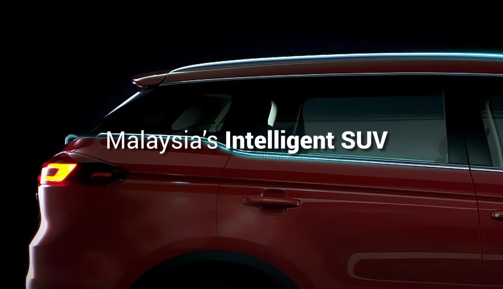

Despite the ongoing pandemic and lockdown measures, Proton is launching a new X70 Special Edition model. For those who are keen, Proton has also opened up registration of interest for the new SUV.

According to the [teaser video](https://youtu.be/kNO0l1CKp3Y), the Proton X70 SE promises to offer “intelligence unlike any other” and they are calling it Malaysia’s “Intelligent SUV”. In addition, the new SE model is said to come with a brand new look.

As a result of this announcement, we have removed all Wear OS smartwatches from this list except the eligible TicWatch models. New Wear OS smartwatches will be added to this list as they are announced and confirmed to include or be eligible for an update to Wear OS 3.

([source](https://soyacincau.com/2021/07/20/proton-x70-special-edition-with-enhanced-features-launching-this-thursday/))

