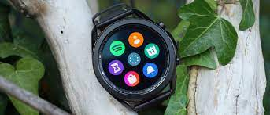
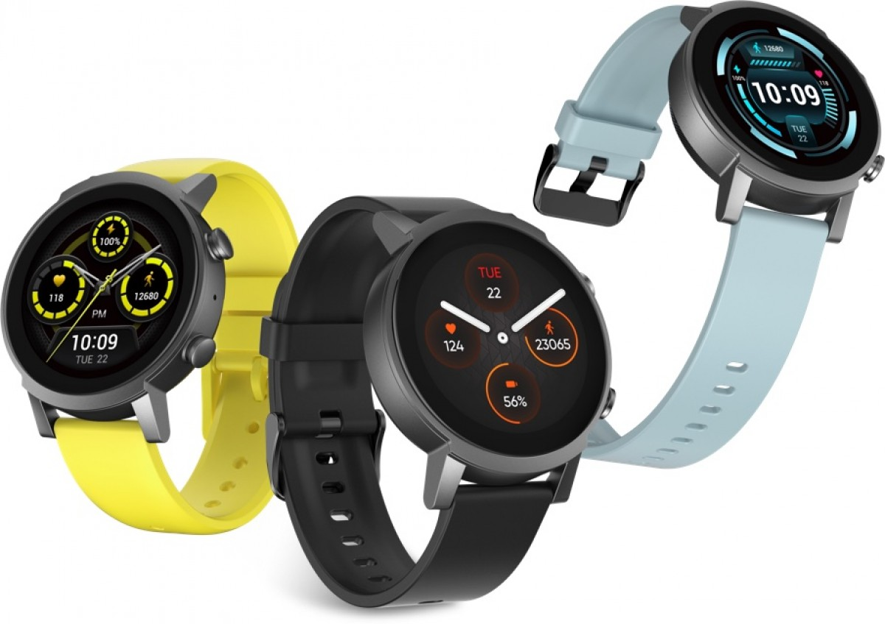

### Don’t buy a Wear OS watch right now
During the Google I/O 2021 google have annouced that it will pay more attention to their wearable devices hence they have annouced the huge collaboration with the Tech giant Samsung. Together with Samsung, they have team up and revamp the inferior Wear OS platform with “Wear OS 3”. Its about time that Google realizes it need to step up the game or face getting kick out of the wearable devices section. However, it comes with some major impacts for the market as it stands today.

For the time being, we strongly advise that you do not buy any current Wear OS smartwatches. As it stands right now, only two options will be updated to Wear 3, the TicWatch Pro 3 and TicWatch E3. No other watches are confirmed to be updated at this time.

As a result of this announcement, we have removed all Wear OS smartwatches from this list except the eligible TicWatch models. New Wear OS smartwatches will be added to this list as they are announced and confirmed to include or be eligible for an update to Wear OS 3.

### Samsung Galaxy Watch 3/Galaxy Watch Active 2
#### The closest you can get to the Apple Watch
The somewhat sad truth about smartwatches on Android is that, no matter how hard all of them have worked, they aren’t as good as the Apple Watch. However, Samsung’s current crop of watches gets you about as close as possible with the Galaxy Watch Active2 and Galaxy Watch 3.

Why these are the best smartwatches for Android:
Samsung’s Galaxy Watch series doesn’t actually run an Android-based OS. Rather, Samsung’s Tizen runs the show. It’s a slick operating system that’s designed with the hardware in mind, meaning the two feel cohesive together.

The two watches differ greatly in looks, though. The Galaxy Watch 3 comes in 41mm and 45mm variants, one using 20mm bands and the other 22mm. There are also two sizes for the Galaxy Watch Active2 with 40mm and 44mm options. Both use 20mm bands.

For all of these watches, you’ll find almost the same set of features. Both charge wirelessly, offer more expensive LTE variants and can manage around two days on a charge. Health features include the classics such as heart rate, step counting, and workout detection, but there’s also fall detection, blood oxygen readings, and ECG support is coming.

The two watches differ greatly in looks, though. The Watch 3 has more of a classic, rugged aesthetic where the Watch Active 2 is a bit sportier. Functionally, they’re nearly identical outside of the physical bezel on the Watch 3 which gives some extra tactile input when you’re scrolling around the UI.

If you have a Samsung smartphone, these watches are pretty much no-brainers. They pair easily with Galaxy phones and bring a ton of genuinely useful features too. On other Android phones, you’ll lose out on a couple of features and the pairing process is a bit more complicated, but overall it’s still stellar. If health is your priority but you’re not willing to give up on the classic smartwatch experience, Galaxy Watch Active 2 and Galaxy Watch 3 are easily some of the best smartwatches for Android.

### TicWatch Pro 3/E3
#### The only Wear OS products you should buy today
The Mobvoi brand is best known for its affordable Wear OS smartwatches, but its TicWatch Pro 3 and TicWatch E3 are now notable for a different reason — they’re the only options getting Wear OS 3 that you can buy right now.

([source](https://9to5google.com/2021/07/22/best-android-smartwatches/))

